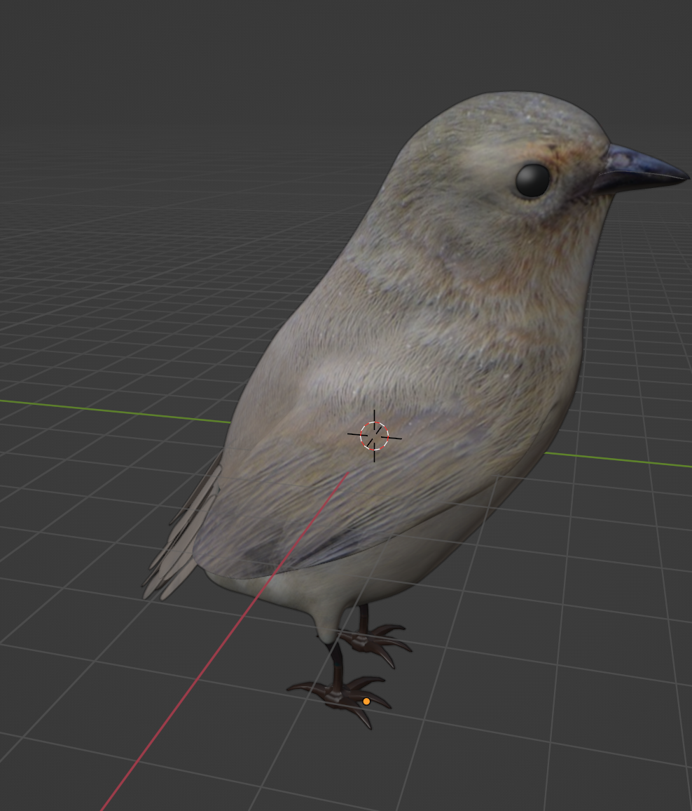

# objaverse-handling
Code for creating a dataset with 3D models from [Objaverse](https://arxiv.org/abs/2212.08051). It allows to: 
- download a given number of objects from chosen categories
- creating a subset of [3D models](https://objaverse.allenai.org)
- keeping track of ids and metadata

To download the models, we use the categories they belong to according to their [LVIS annotations](https://huggingface.co/datasets/allenai/objaverse/blob/main/lvis-annotations.json.gz).
There are a total of 1156 categories according to the LVIS annotations. 
We downloaded 10 objects from 200 distinct categories, for a total of 2000 3D models.

## Usage 
1. Git fork the repo
2. Create a python/conda environment with python>=3.7 (I personally use 3.9) and activate it. 
3. Inside the project root directory, pip install the package locally with the command: 
```
pip install -r requirements.txt
```
4. The file ```config.ini``` shows the paths used by default. Change any of these variables as necessary. 

#### When downloading objects for the first time 
One has to specify: 
- the file from which to get the names of the categories (.csv format)
- the number of categories to download 
- the number of objects to download from each category
- the file where to store the dictionary of uids 
- the name of the worksheet in which will be stored the location of the downloaded models. 


#### When downloading missing objects 
One has to specify: 
- the file with the dictionary of uids (that has been modified when curating the models) 
- the file with the removed uids (created when curating the models)
- the file where to store the new dictionary of uids
- the worksheet where to store updated location of the downloaded models.

##### Note
In this version, the code takes objects iteratively, one after the other in the order they appear in the LVIS annotations dictionary. 
The selection is not randomized.

##### Example 
Here is an example of a bird 3D model downloaded (rendered in blender, left, front and right view).  




uid: '46b359fc3ebf4412917b915415d59e05.glb'
